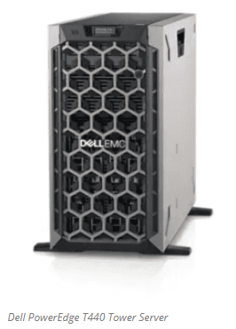
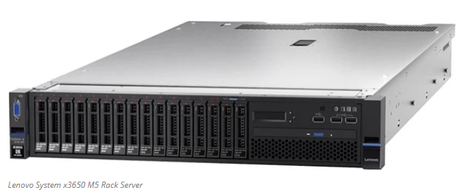
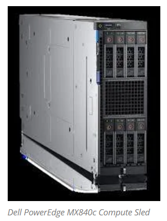

# Oppimispolku DataCenterFromZero

0. Lähtötilanne – Sovellus on kasvanut yli olemassa olevien rajojen

Yrityksen X mobiilisovelluksella on:

    Nopeasti kasvanut käyttäjäkunta (kymmenistä tuhansista satoihin tuhansiin tai miljooniin)

    Verkkosivuston ja GitHubin kapasiteetti ja suorituskyky eivät enää riitä

    Käyttäjät valittavat hitautta, katkoksia ja skaalautumattomuutta

    Tarve hallita itse laitteistoa, suorituskykyä, tietoturvaa ja kustannuksia

➡️ Tästä syntyy päätös: Perustetaan oma datakeskus.

1. Strateginen päätöksenteko ja liiketoimintaperustelut
Päätöksentekijät:

    Johto, CTO, CFO, mahdollisesti hallitus

Tehtävät:

    Kustannusvertailu: jatketaanko pilvessä, ulkoistetaanko vai rakennetaanko oma

    TCO-analyysi: arvioidaan elinkaarikustannukset (rakentaminen, ylläpito, energiankulutus)

    Skaalautuvuus: tuleeko oma datakeskus todella tarjoamaan parempaa kontrollia ja suorituskykyä?

    Ympäristövaikutukset ja regulaatiot (esim. EU CSRD, energiatehokkuusdirektiivit)

➡️ Tuloksena: liiketoimintapäätös oman datakeskuksen perustamisesta.

2. Arkkitehtuurisuunnittelu ja sijainnin valinta
Suunnittelijat:

    IT-arkkitehdit, laitesuunnittelijat, energia-asiantuntijat

Tehtävät:

    Sijainnin valinta: sähkön hinta, viiveet, kaapelointi, veden saatavuus (jäähdytys), luonnonriskit

    Kapasiteettisuunnittelu:

        Kuinka monta rackia, kuinka paljon tehoa per rack (kW)

        Tarvitaanko GPU-klustereita, AI-infrastruktuuria?

    Sähkönsyöttö ja UPS-ratkaisut (varavoima, generaattorit)

    Jäähdytysärjestelmä: ilmajäähdytys, nestejäähdytys, waste heat -talteenotto

    Yhteydet: kuituverkot, reititys, BGP, CDN

➡️ Tuloksena: tekninen suunnitelma ja alustavat piirustukset

3. Rakennusprojekti ja laitehankinnat
Osallistujat:

    Kiinteistökehittäjät, sähkö- ja LVI-insinöörit, laitehankintatiimi

Tehtävät:

    Rakennetaan fyysinen tila tai valitaan modulaarinen esivalmistettu ratkaisu

    Hankitaan laitteisto:

        Palvelimet (tower,rack,blade)
       
       Tornipalvelin on palvelin omalla itsenäisellä kotelolla. Ne valmistetaan minimaalisella komponenttien ja ohjelmistoja määrällä, joten keskikokoiset ja suuryritykset voivat mukauttaa
       niitä omiin tiettyihin tehtäviinsä. Tornipalvelimissa ei yleensä ole näytönohjaimia, suurta RAM-muistia tai oheislaitteita. 
       Tornipalvelimet on tyypillisesti suunnattu asiakkaille, jotka haluavat mukauttaa palvelimiaan ja ylläpitää mukautettua päivityspolkua.
       Asiakkaat voivat esimerkiksi konfiguroida tornipalvelimia yleiskäyttöisiksi palvelimiksi, tietoliikennepalvelimiksi, web-palvelimiksi tai verkkopalvelimiksi, 
       jotka integroituvat HTTP-protokollien avulla.
       Tornipalvelin voidaan hankkia yrityksen tarpeisiin joko **räätälöitynä valmiiksi** tai **varustaa itse halutuilla komponenteilla**, kun palvelin toimitetaan toimipisteeseen. 
       Tämä antaa joustavuutta IT-infrastruktuurin rakentamiseen erityisesti pienissä ja keskisuurissa organisaatioissa.
       Yleisesti asennettavia komponentteja:
       **Keskusmuisti (RAM)** – sovellusten suorituskykyä varten
       **Tallennuslevyt (SSD / HDD)** – nopeaa tai suurivolyymista tietovarastointia varten
       **RAID-konfiguraatiot** (Redundant Array of Independent Disks) – levyjärjestelmän vikasietoisuutta ja suorituskykyä parantamaan
       RAID-teknologia yhdistää useita kiintolevyjä yhdeksi kokonaisuudeksi, mahdollistaen **datan redundanssin**, **suuremman suorituskyvyn** tai molemmat – riippuen käytetystä 
       RAID-tasosta (esim. RAID 1, RAID 5, RAID 10).
       **NIC-verkkokortit (Network Interface Cards)** – lähiverkkoyhteyksien toteutukseen ja nopeuden skaalaamiseen
       Toinen käyttötapaus on pienempi yritys, joka tarvitsee yhden tehokkaan palvelimen useiden prosessien ja sovellusten suorittamiseen. 
       Ulkoisesti ne muistuttavat pöytätietokoneita, ja – kuten pöytätietokoneet – ne eivät jaa syöttölaitteita. Useiden tornipalvelimien kanssa tarvitaan jokaselle erilliset näppäimistöt, 
       hiiret ja näytöt tai kytkimet, jotka mahdollistavat oheislaitteiden jakamisen. 
       Tornipalvelimet voivat jakaa verkkotallennustilaa kuten minkä tahansa muun tyyppiset palvelimet.
       ## 🏢 Tower-palvelimen edut ja haitat

        | **Edut (Pros)** | **Haitat (Cons)** |
        |-----------------|------------------|
        | 🔧 **Joustava päivitettävyys**: Vähäinen peruskonfiguraatio mahdollistaa mukauttamisen liiketoiminnan tarpeisiin. Edullisempi kuin täysin varusteltu palvelin. 
        | 💸 **Korkeat päivityskustannukset**: Räätälöinti ja tehokkaat komponentit voivat nostaa kokonaishintaa huomattavasti. |
        | ❄️ **Alhaiset jäähdytyskulut**: Alhainen komponenttitiheys tekee tornipalvelimista energiatehokkaampia viilentää kuin tiheät rack- tai blade-palvelimet. 
        | 🧱 **Suuri tilantarve**: Ei sovi räkkeihin ja vie runsaasti tilaa. Sisäosien päivitys vaatii kotelon avaamista. |    
        | | 🔌 **Vaivalloinen oheislaitteiden hallinta**: Useiden tornien ympäristössä tarvitaan erillisiä kytkimiä tai käsin tehtävää johdotusta laitteiden välillä. |
        https://www.serverwatch.com/hardware/blade-servers-vs-rack-servers/
       
       
       Räkkipalvelin on räkin sisään asennettu palvelin. Räkkipalvelimet ovat tyypillisesti yleiskäyttöisiä palvelimia, jotka tukevat laajaa valikoimaa sovelluksia ja laskentainfrastruktuuria. 
       Standardoituja räkkejä mitataan yksiköissä (Units, U), jotka ovat 1,75 tuumaa korkeita ja 19 tuumaa leveitä. 
       Räkkipalvelimet sopivat näihin mittoihin pystysuuntaisten kertoimien avulla, mikä tarkoittaa, että räkkipalvelinten korkeudet voivat olla 1U, 4U, 10U tai korkeammat, 
       kuten vuonna 2016 julkaistu 10 jalkaa korkea 70U-räkki. Lisälaitteita valmistetaan myös räkkiyksikköstandardin mukaisesti, joten yritykset voivat käyttää tyhjiä yksiköitä räkeissään.
       Räkit pinoavat palvelimia pystysuunnassa säästääkseen datakeskuksen lattiatilaa. Mitä enemmän laitteita ylläpitäjät voivat pinota pystysuunnassa, sitä enemmän laitteita ne voivat majoittaa.
       Yhdestä kahdeksaan räkkipalvelinyksikköä voidaan asentaa räkkirakenteen lokerikoihin. Toisin kuin tornipalvelimissa, jotka säilytetään omissa kaapeissaan, palvelinräkissä on matalampi profiili, jonka               ansiosta palvelimet voivat olla hyllyllä pitäen ne irti lattiasta. 
       Räkkipalvelimia voidaan pinota, laajentaa ja ehkä tärkeimpänä verkottaa. 
       
       ## 🗄️ Rack-palvelimen edut ja haitat

        | **Edut (Pros)** | **Haitat (Cons)** |
        |-----------------|------------------|
        | 🔌 **Itsenäinen yksikkö**: Jokaisessa rack-palvelimessa on oma virtalähde, prosessori ja muisti, joten se voi toimia erillisenä tai verkotettuna järjestelmänä. 
        | ⚡ **Korkea energiankulutus**: Tiheät rackit vaativat enemmän jäähdytystä, mikä kasvattaa energiakustannuksia. |
        | 📏 **Tilatehokkuus**: Rack-malliset laitteet hyödyntävät konesalitilan tehokkaasti. Laajennettavissa helposti lisämuistilla, levyillä ja prosessoreilla. 
        | 🧰 **Ylläpidon haasteet**: Tiheä kokoonpano vaatii enemmän vianetsintää ja ylläpitoa. |
        | 🔄 **Helppo vaihto**: Palvelimet voidaan hot-swapata fyysisesti helposti, jos tiedot on jaettu tai klusteroitu. | |
        | 💰 **Kustannustehokkuus pienissä ympäristöissä**: Tarjoaa hallinta- ja energiatehokkuutta pienemmillä kustannuksilla. | |
           
       [https://www.serverwatch.com/hardware/rack-server/]
       
       
       Blade-palvelin on kompakti, itsenäinen laskentamoduuli, joka mahtuu standardoituun koteloon, jota kutsutaan blade-rungoksi. 
       Blade-palvelin on kuin itsenäinen palvelin "korttimuodossa", joka liitetään yhteiseen infrastruktuuriin – aivan kuten I/O-kortti liitetään emolevyyn. 
       Tämä mahdollistaa suuren palvelintiheyden ja tehokkaan resurssien jaon datakeskuksissa.
       Jokainen blade-palvelinmoduuli sisältää keskusyksikön (CPU), 
       muistin, tallennustilan ja verkkoliitännät, jotka on optimoitu tehokkuutta varten, mikä tekee blade-palvelimista ihanteellisia datakeskusympäristöihin.
       Kotelot sopivat räkkiykiskön mittoihin, säästäen IT-osaston tilaa. Järjestelmänvalvojat voivat klusteroida bladeja tai hallita ja käyttää kutakin erikseen omana erillisenä palvelimenaan, 
       esimerkiksi määrittämällä sovelluksia ja loppukäyttäjiä tietyille bladeille. Niiden modulaarinen arkkitehtuuri tukee hot swap -toimintoja. Bladeissa on pienet ulkoiset kahvat, 
       joten niiden irrottaminen tai vaihtaminen on helppoa.
       Blade-palvelin on erikoistunut laskentalaite suunniteltu käytettäväksi datakeskuksissa ja yritysympäristöissä, poiketen perinteisistä telinepalvelimista sekä muodon että skaalautuvuuden suhteen.

        ## Blade-palvelimen edut ja haitat

        | **Edut** | **Selitys** |
        |----------|-------------|
        | **Alhainen energiankulutus** | Usean erillisen palvelimen sijaan yksi blade-runko jakaa virran ja jäähdytyksen kaikille bladeille, mikä pienentää energiakustannuksia. |
        | **Tehokas laskentateho** | Tarjoavat suuren prosessointikapasiteetin pienessä fyysisessä tilassa. |
        | **Monikäyttöisyys** | Voidaan käyttää käyttöjärjestelmien, virtualisointialustojen, tietokantojen, sovellusten ja verkkopalvelujen isännöintiin. |
        | **Saatavuus ja hallinta** | Yhtenäinen alusta helpottaa valvontaa, kuormanjakoa ja vikasietoisuutta. Hot swap ‑tuki lisää käytettävyyttä. |
        
        ---
        
        | **Haitat** | **Selitys** |
        |-----------|-------------|
        | **Korkeat alkuinvestoinnit** | Vaikka käyttöaikaiset kulut ovat matalat, aloituskustannukset ja käyttöönotto voivat olla korkeat. |
        | **Jäähdytyksen tarve** | Suuri tehotiheys vaatii kehittynyttä lämpötilanhallintaa: tehokasta jäähdytystä, ilmanvaihtoa ja ilmastointia. |

        
        Tallennusratkaisut (NAS, SAN, SSD-pohjaiset järjestelmät)

        Kytkimet, palomuurit, reitittimet

        Rackit, kaapelointi, jäähdytys

        Kaikki kolme palvelintyyppiä voivat toimia datakeskuksessa. Valinta ei niinkään ole siinä, mitä ne pystyvät tekemään – kaikki kolme palvelintyyppiä pystyvät korkeaan suorituskykyyn. 
        Kyse on siitä, mikä koko ja arkkitehtuuri sopivat parhaiten laskentatarpeisiisi ja datakeskuksen kokoonpanoosi.

➡️ Tuloksena: valmis tila, laitteet toimitettuna

4. Asennus, konfigurointi ja testaus
Vastuut:

    DevOps, infra-asiantuntijat, tietoturva, QA-tiimi

Tehtävät:

    Verkon perustaminen ja suojaus

    Asennetaan käyttöjärjestelmät ja alustat (esim. Kubernetes-klusterit, Docker, virtualisointi)

    Suojaus ja valvonta (firewall, IDS/IPS, SIEM, auditointi)

    Stressitestit ja varmistus: sovelluskuormien ajaminen, failover-skenaariot

➡️ Tuloksena: toimiva perusinfrastruktuuri

5. Sovelluksen siirto ja tuotantoon vienti
Projektitiimi:

    Sovelluskehittäjät, tietokanta-asiantuntijat, DevOps

Tehtävät:

    Migroidaan käyttäjädata, backend-palvelut ja API:t

    Järjestetään nollakatkojen siirtymä tai vaiheistettu käyttöönotto

    Monitorointi, lokienkeruu ja skaalautuvuusratkaisut käyttöön

➡️ Tuloksena: sovellus toimii omassa datakeskuksessa, käyttäjien kokemus paranee

6. Operointi, ylläpito ja optimointi
Ylläpitäjät:

    Sysadminit, NOC-tiimi, energiatehokkuusvastaavat

Tehtävät:

    Päivittäinen operointi, huoltotyöt, laitevaihdot

    Energian- ja lämmönkulutuksen optimointi

    Tietoturvaprosessien jatkuva valvonta

    Auditoinnit ja raportointi (myös ympäristöraportit jos EU-direktiivit koskevat)

➡️ Tuloksena: skaalautuva, tehokas ja vastuullinen oma datakeskus

Green ICT -suunnittelu alusta asti

Jos yritys X haluaa toimia vastuullisesti:

    Valitaan uusiutuva energialähde

    Jäähdytysjärjestelmä mahdollistaa hukkalämmön hyödyntämisen

    Modulaarinen rakenne mahdollistaa skaalauksen ilman suurta rakentamista

    Materiaalit valitaan kierrätettäviksi

  
### Yhteenveto päätöksentekijän näkökulmasta

| Vaihe          | Päätöksentekijän vastuu                                                     |
|----------------|-----------------------------------------------------------------------------|
| Strategia      | Hyväksyy investoinnin liiketoimintaperustein                                |
| Arkkitehtuuri  | Varmistaa että ratkaisu tukee pitkän aikavälin kasvua                       |
| Rakentaminen   | Varmistaa aikataulu ja budjetti                                             |
| Käyttöönotto   | Tukee muutosjohtamista ja asiakaskokemusta                                  |
| Operointi      | Varmistaa, että investointi toimii – teknisesti ja liiketoiminnallisesti    |

